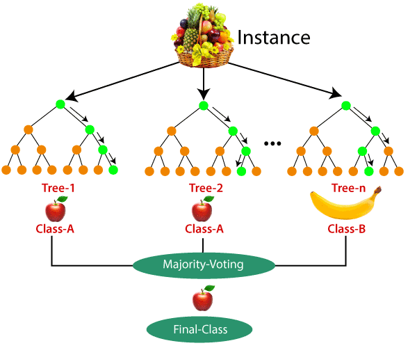

# Random Forest:

- It is Supervised learning technique.
- It can be used for both 	classification and regression problem
- It is based on ensemble learning & It is also technique to perform Bagging

 Random Forest Classifier that contain a number of Decison Trees on various subsets 

Why we Use Random Forest
- It takes less cmp to other algo.
- It predict Output with High Accuracy.
- It handle missing data as well as accuracy

How Does Random Forest Algorithm Work
<li> Select random k data points from the training set </li>
<li>Build the decison trees associated with selected data points</li>
<li>Choose the number n for decison trees that you want to build</li>
<li> Repeat step 1&2 </li>
<li> For New Data point find the predictions of each Decison Tree and assign the new data points to the category that wins the majority votes</li>
Examples Fruit

- It is Used in various domains, Such as bank to identify loan risk,
Medicine disease,Land use,Marketing.

---*---