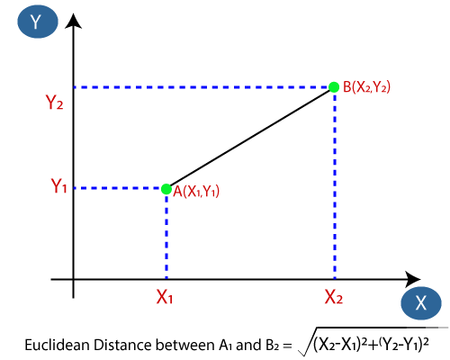
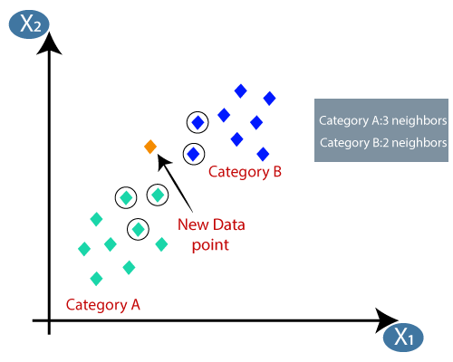

# KNN  
## K-nearest neighbour

<li> K-nearest neighbour it is a supervised machine learning algorithm </li>
<li>It is assume similarity case between previous case and the new cases </li>
<li> It is used for classification as well as regression </li>

<ol>Examples : Cat/Dog Identification it find similarity between images. And Put it On the right category </ol>

## Steps of KNN :
<ol> Select the number of k of the neighbors </ol>
<ol> Calculate the euclidean distance of K number of neighbors </ol>
<ol> Take the k nearest neighbours as per euclidean distance </ol>
<ol> Among these kneighbors count the number of points in category </ol>
<ol>Assing a the new data in which category for which the number is maximum </ol>
<ol>Model is ready</ol>

It find distance like this:
 

 
After new Category come it will find like this:
 

<li> Here we see 3 points are closest</li>
 

