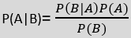

# Naive Bayes Classifier Algorithm:

 Naive bayes algorithm it is a supervised machine learning algorithm which is based on bayes theoram and it is used for classification problem 

- It is based Probablity which means it is Probablistic classifier.

 Example are: Filteration , Sentimental Analysis and classifying articles.

P(A|B) : it is posterior probablity ,where b event is already happen.probability of hypothesis A on the observed event b 

P(B|A) : it is likelihood probablity: Probabilty of the evidence given that the probablity of a hypothesis is true .

P(A) is Prior Probablity : Probablity of hypothesis before observing the evidence

P(B) is Marginal Probability : Probability of evidence .

 Working of Naive Bayes 

- convert the given data to frequency tables.
- Generate the Likelihood table by finding the probablities of given features 
- Now, use therom to calculate posterior probablity

<em>Types of Naive Bayes Model </em>

- Gaussian : Gaussian Model assumes that features follow a normal Distribution.Instead of Discrete takes continous values 
- Multinomial : Multinomial classifier if data is multinomial distributed ex : Document belong to sport ,politics ,education etc

